# AI ML Governance Policy as Code

AI/ML infrastructure governance using Sentinel and OPA Gatekeeper to enforce cost controls, security policies, and EU AI Act compliance at both the Terraform plan stage and Kubernetes admission time.

## Overview

Organisations deploying AI workloads face a real problem: a single unapproved GPU instance can rack up thousands in monthly compute costs, and untracked model deployments create compliance nightmares under frameworks like the EU AI Act. This project implements a two-layer policy enforcement architecture that catches violations before they ever reach production.

The first layer uses HashiCorp Sentinel to gate Terraform plans — blocking unapproved GPU instances, enforcing mandatory resource tagging for cost attribution, and capping monthly infrastructure spend. The second layer uses OPA Gatekeeper as a Kubernetes admission controller, ensuring every ML model deployment carries proper version tracking, team attribution, and model registry references before it's admitted to the cluster.

The underlying infrastructure provisions an EKS cluster with KMS-encrypted secrets, a versioned S3 bucket for model artifacts, and a VPC with flow logging — all tagged for ML cost allocation across multiple teams.

## Architecture

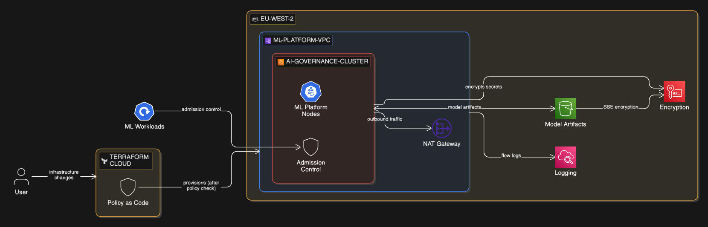

Sentinel policies run at plan time inside Terraform Cloud, validating infrastructure changes against four policies (GPU controls, resource tagging, spending limits, and model deployment rules) before any AWS resources are provisioned. Once infrastructure is live, OPA Gatekeeper operates as an admission webhook on the EKS cluster, evaluating every Deployment and StatefulSet against constraint templates that enforce label requirements and model registry validation. This creates a defence-in-depth approach where policy violations are caught at two distinct stages of the deployment lifecycle.

## Tech Stack

**Infrastructure**: AWS EKS, VPC, S3, KMS, Terraform

**Policy Enforcement**: HashiCorp Sentinel (4 policies), OPA Gatekeeper (2 constraint templates + 2 constraints)

**Compliance**: EU AI Act risk classification, mandatory ML governance labels, model registry validation

**Cost Controls**: GPU instance restriction, per-team budget caps, automated spend limits

## Key Decisions

- **Two-layer enforcement over single-layer**: Sentinel catches infrastructure-level violations (wrong instance types, missing tags) at plan time, while OPA catches workload-level violations (unregistered models, missing version labels) at deploy time. Neither layer alone covers both concerns.

- **Hard-mandatory vs. advisory enforcement levels**: GPU controls and tagging are hard-mandatory because violations have immediate financial or compliance impact. Model deployment rules are advisory to avoid blocking experimentation in non-production environments.

- **KMS encryption for both EKS secrets and S3 model artifacts**: A single KMS key encrypts cluster secrets and model storage, simplifying key management while ensuring model IP is protected at rest across both storage layers.

- **Cost-effective demo architecture**: Uses t3.medium instances with GPU node groups commented but fully defined, demonstrating production-ready GPU scaling patterns without incurring GPU costs.

## Screenshots

**Terraform VCS Provider Configuration** — Initial setup linking the GitHub repository to Terraform Cloud. The configuration stores the OAuth token and webhook URLs required for automated policy enforcement on pull requests and merges.

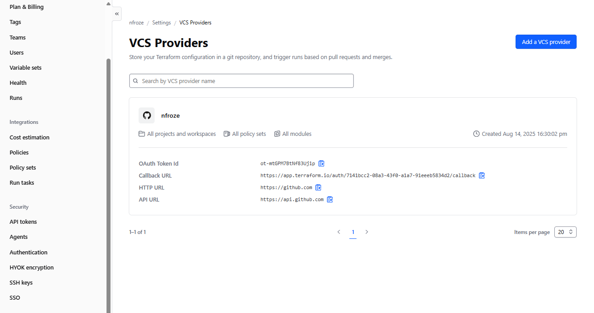

**Policy Sets in Terraform Cloud** — The Sentinel policy set is connected to the workspace, configured to run on all plans. This is where the four governance policies are centrally managed and enforced across the infrastructure-as-code pipeline.

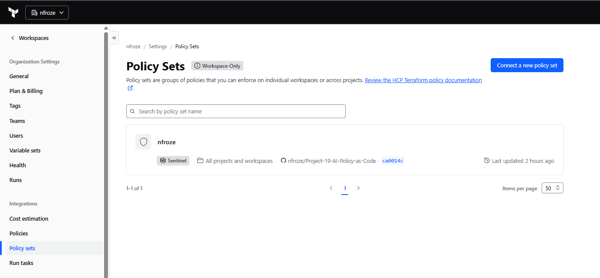

**Terraform Run with Sentinel Validation** — A successful Terraform plan that passed the Sentinel policy evaluation. The run shows plan completion, policy checks passed, and application of 75 new resources without changes or deletions to existing infrastructure.

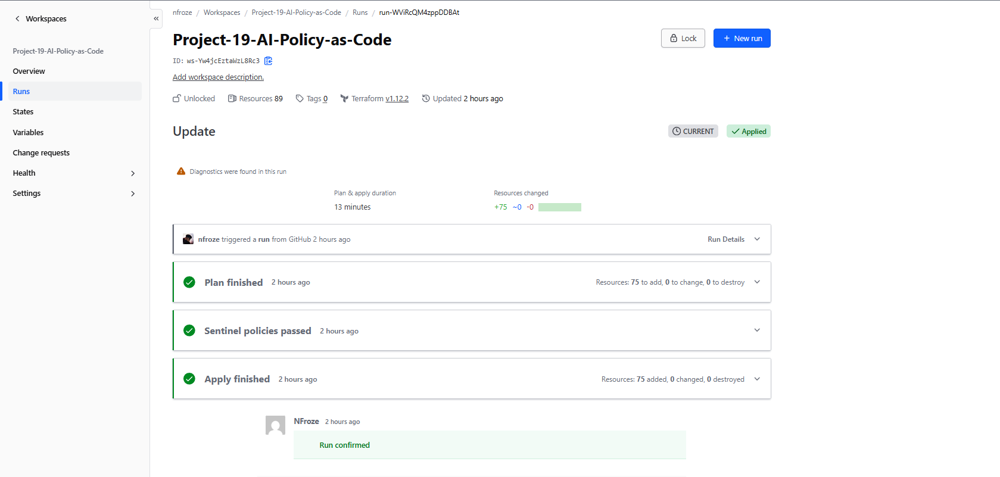

**Sentinel Policy Evaluation Results** — Detailed breakdown of the four policies that executed during the Terraform plan. All policies passed, including AI Resource Governance (mandatory tagging), AI/ML Spending Control (cost limits), GPU Instance Control (preventing unauthorized GPU instances), and ML Model Deployment Governance (enforcing best practices).

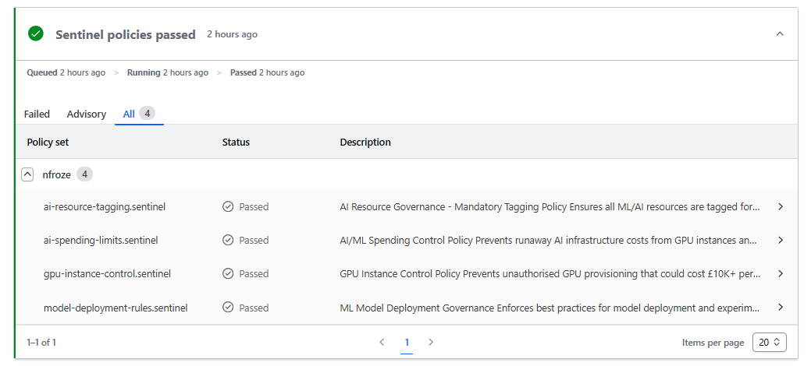

**Kubernetes Audit Log Showing Deployments** — The audit cluster showing all infrastructure components deployed by Terraform, including the Sentinel policy analysis service, OPA Gatekeeper components, and core Kubernetes services. This demonstrates the complete deployment stack with all governance components running.

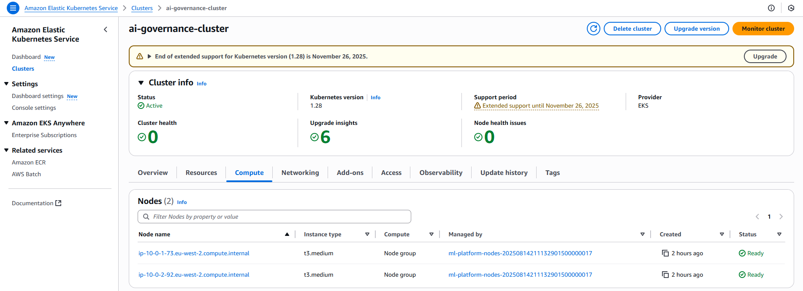

**OPA Gatekeeper Blocking Invalid ML Deployment** — A deployment admission is denied by the OPA Gatekeeper webhook. The error shows missing mandatory labels ("model-version" and "ml-team") required for cost tracking, model versioning, and EU AI Act compliance. The policy enforces that all model deployments must carry proper governance metadata.

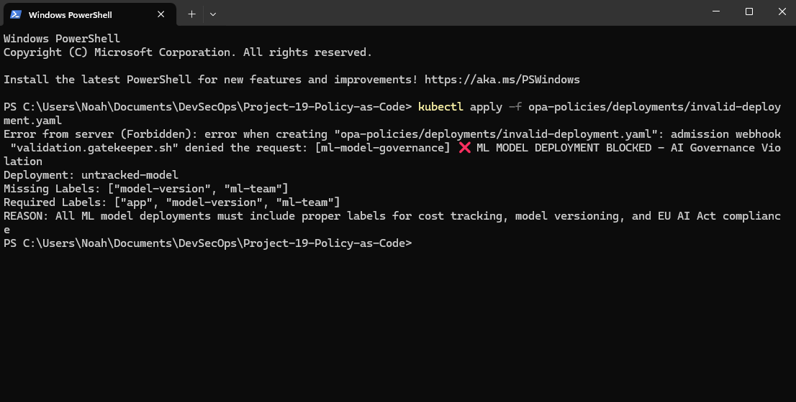

**OPA Gatekeeper Allowing Valid ML Deployment** — A valid deployment is successfully created after proper governance labels are applied. The Sentiment Analyzer v2 deployment is admitted to the cluster, demonstrating that properly labelled ML workloads pass the admission control checks.

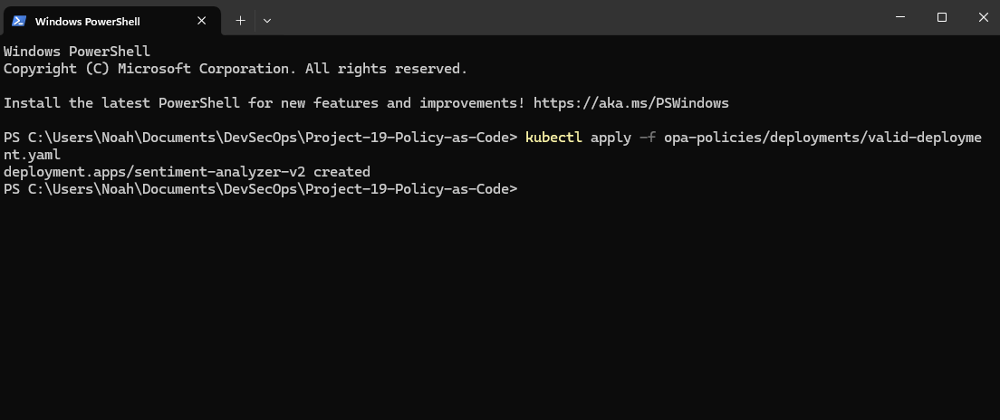

**Cluster Ingress Confirming Kubernetes Deployment** — The Nginx welcome page served by the cluster ingress controller, confirming that the EKS cluster is deployed, operational, and accessible. This verifies the foundational infrastructure layer is running.

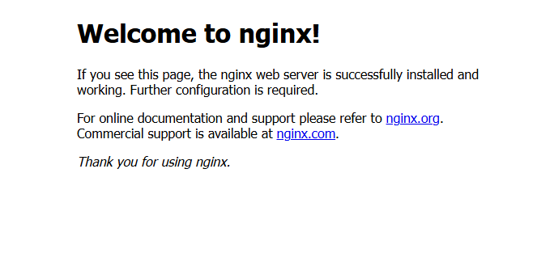

**Kubernetes Pod Status Verification** — Output of `kubectl get pods` across all namespaces showing all governance and infrastructure components running in the cluster, including the OPA Gatekeeper audit and control-plane services, Sentinel analyzer, Kubernetes core services, and AWS node management pods.

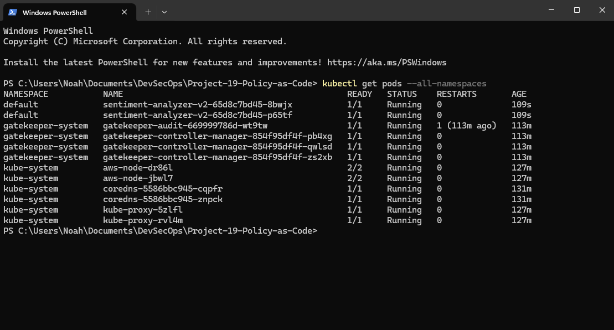

**Terraform Cloud Run History and Deployment Details** — The comprehensive run details showing the full lifecycle: plan generation (75 resources to add), Sentinel policy validation, and successful apply. The run was triggered by a GitHub push, demonstrating the complete GitOps workflow from version control to policy-driven infrastructure deployment.

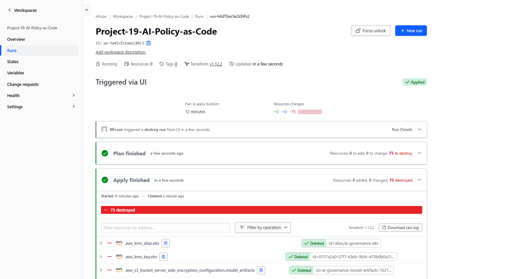

## Author

**Noah Frost**

- Website: [noahfrost.co.uk](https://noahfrost.co.uk)
- GitHub: [github.com/nfroze](https://github.com/nfroze)
- LinkedIn: [linkedin.com/in/nfroze](https://linkedin.com/in/nfroze)
